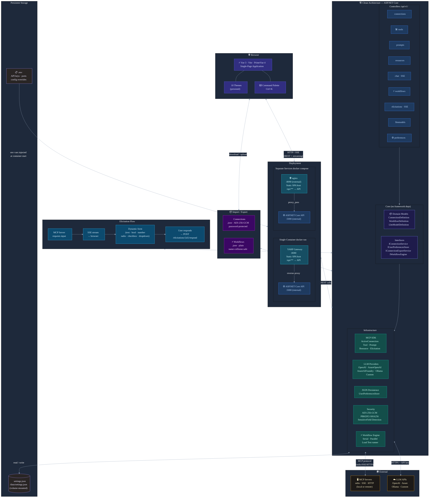

# MCP Explorer

A modern MCP (Model Context Protocol) server explorer — browse tools, prompts, resources, and chat with LLMs over live MCP connections. Built with a **Vue 3 / Vite / PrimeVue** frontend + **ASP.NET Core** backend using clean architecture.

📚 **[Documentation →](docs/learn/)** — full user guide and feature reference built with Hugo

## Features

- 🔌 **MCP Connections** — Connect to stdio, SSE, and HTTP MCP servers with custom headers and OAuth/Azure credentials
- 🛠️ **Tools** — Browse and invoke tools with dynamic parameter forms; inspect JSON responses inline
- 💬 **Prompts** — List, execute, and evaluate prompts; pipe results directly to an LLM
- 📄 **Resources & Templates** — Browse MCP resources; expand templates with runtime parameters
- 🤖 **Chat** — SSE-streamed AI chat with automatic MCP tool calling; shows token usage and active tool badges
- ⚡ **Workflows** — Multi-step tool chain builder with execution history and built-in load testing
- 🛡️ **Sensitive Data Protection** — Regex + heuristic detection of secrets in tool parameters and chat messages; AES-256 encryption at rest
- 🎨 **10 Themes** — Command Dark/Light, Nord, Dracula, Catppuccin Mocha, Solarized Light, GitHub Dark/Light, Material Dark/Light — persisted per user
- ⌨️ **Command Palette** — Ctrl+K / ⌘+K for keyboard-first navigation

## Architecture



### Project Layout

```
src/
├── Garrard.Mcp.Explorer.Core/           # Domain models + interfaces (no framework deps)
├── Garrard.Mcp.Explorer.Infrastructure/ # MCP SDK, LLM providers, persistence, security
├── Garrard.Mcp.Explorer.Api/            # ASP.NET Core Web API (9 controllers, versioned)
├── Garrard.Mcp.Explorer.Gateway/        # YARP reverse proxy + Vue SPA host
├── Garrard.Mcp.MessageContentProtection/# Sensitive data detection library
└── frontend/                            # Vue 3 + Vite + PrimeVue 4 SPA
    ├── src/api/          # Typed API client layer
    ├── src/stores/       # Pinia stores (chat, connections, preferences, themes, workflows)
    ├── src/views/        # 10 feature views
    ├── src/components/   # Shared components (CommandPalette, ThemeSwitcher, JsonViewer)
    └── src/themes/       # CSS custom property themes

tests/
├── Garrard.Tests.Mcp.Explorer.Core/           # 66 unit tests
├── Garrard.Tests.Mcp.Explorer.Infrastructure/ # 47 unit tests
└── Garrard.Tests.Mcp.Explorer.Api/            # 34 unit tests

docs/
└── learn/                                     # Hugo documentation site (serve with: hugo server -s docs/learn)
```

## Getting Started

### Prerequisites

- [.NET 10 SDK](https://dotnet.microsoft.com/download)
- [Node.js 22+](https://nodejs.org/) and npm
- Docker (optional, for containerised deployment)

### Development

```bash
# 1. Clone and restore
git clone <repo-url>
cd mcp-explorer-v2
dotnet restore

# 2. Copy env config
cp .env.example .env
# Edit .env with your LLM API keys

# 3. Start the API (terminal 1)
dotnet run --project src/Garrard.Mcp.Explorer.Api

# 4. Start the frontend dev server (terminal 2)
cd src/frontend
npm install
npm run dev
# Opens http://localhost:5173 (proxied to API on :5000)

# 5. Run tests
dotnet test
```

### Production Build

```bash
# Build frontend
cd src/frontend && npm run build && cd ../..

# Build and run the gateway (hosts built Vue SPA + proxies API)
dotnet publish src/Garrard.Mcp.Explorer.Gateway -c Release -o out/gateway
dotnet run --project src/Garrard.Mcp.Explorer.Api &
dotnet out/gateway/Garrard.Mcp.Explorer.Gateway.dll
```

## Docker

### Single Container (recommended for simple deployments)

```bash
# Build
docker build --build-arg APP_VERSION=2.0.0 -t mcp-explorer:2.0.0 .

# Run
docker run --rm -p 8080:8080 \
  -e LLM__Provider=OpenAI \
  -e LLM__ApiKey=sk-... \
  -v "$(pwd)/data:/root/.local/share/McpExplorer" \
  mcp-explorer:2.0.0
```

Open [http://localhost:8080](http://localhost:8080)

### Multi-Container (docker-compose)

```bash
cp .env.example .env
# Edit .env

docker compose up --build
```

Services: `api` on `:5000` (internal), `gateway` on `:8080` (external).

## Environment Variables

Copy `.env.example` to `.env` and fill in your values. Key variables:

| Variable | Description | Default |
|---|---|---|
| `ASPNETCORE_ENVIRONMENT` | Runtime env — controls logging/error detail | `Production` |
| `AppMetadata__Version` | Version string shown in UI footer | `0.5.0` |
| `MCP_CLIENT_NAME` | Client name sent to MCP servers in handshake and User-Agent | `mcp-explorer` |
| `MCP_DATA_PATH` | **Host** directory mounted as `/data` — persists connections, workflows, models | _(anonymous volume)_ |
| `PREFERENCES__StoragePath` | Absolute path to `settings.json` inside the container | `/data/settings.json` |
| `LlmService__OpenAiBaseUrl` | Base URL for OpenAI-compatible APIs | `https://api.openai.com/v1` |
| `LlmService__AzureApiVersion` | Azure OpenAI API version query param | `2024-02-15-preview` |
| `LlmService__MaxRetryAttempts` | Max LLM request retries | `3` |
| `LlmService__TimeoutSeconds` | LLM response timeout | `30` |
| `ToolInvoke__TimeoutSeconds` | MCP tool call timeout (0 = no limit) | `300` |
| `ToolInvoke__MaxRetryAttempts` | Tool call retry attempts | `2` |
| `Elicitation__TimeoutSeconds` | Elicitation dialog timeout (0 = wait forever) | `0` |
| `GATEWAY_PORT` | Host port the app is exposed on | `8090` |
| `ReverseProxy__Clusters__api-cluster__Destinations__api__Address` | API address for YARP (docker-compose only) | `http://api:5000/` |
| `VITE_API_BASE_URL` | Browser API base URL (empty = same origin via gateway) | _(empty)_ |
| `VITE_APP_VERSION` | App version baked into the frontend bundle | `0.5.0` |

> **Note:** `VITE_*` variables are baked into the static JS bundle at build time and cannot be changed at runtime.

See `.env.example` for the full annotated list.

## API

All endpoints are versioned at `/api/v1/`. Swagger UI available at `/swagger` in development.

| Prefix | Description |
|---|---|
| `/api/v1/connections` | CRUD + connect/disconnect MCP servers |
| `/api/v1/tools` | List and invoke tools per connection |
| `/api/v1/prompts` | List and execute prompts |
| `/api/v1/resources` | List and read resources + templates |
| `/api/v1/chat` | SSE streaming chat with tool calling |
| `/api/v1/workflows` | Workflow CRUD, execution, load test |
| `/api/v1/elicitations` | SSE stream + respond to server-initiated requests |
| `/api/v1/llmmodels` | LLM model definitions CRUD |
| `/api/v1/preferences` | User preferences + theme |

## Themes

Ten built-in themes, selectable via the top-bar theme switcher or Command Palette:

| ID | Name | Mode |
|---|---|---|
| `command-dark` | Command Dark | Dark |
| `command-light` | Command Light | Light |
| `nord` | Nord | Dark |
| `dracula` | Dracula | Dark |
| `catppuccin` | Catppuccin Mocha | Dark |
| `solarized` | Solarized Light | Light |
| `material` | Material Dark | Dark |
| `material-light` | Material Light | Light |
| `github` | GitHub Dark | Dark |
| `github-light` | GitHub Light | Light |

Theme is persisted to `POST /api/v1/preferences/theme` and cached in `localStorage`.

## Contributing

1. Fork and create a feature branch
2. Run `dotnet test` — all 147 tests must pass
3. Run `npm run build` in `src/frontend` — must complete with 0 errors
4. Submit a PR with a clear description

## License

MIT — see [LICENSE.md](LICENSE.md)
