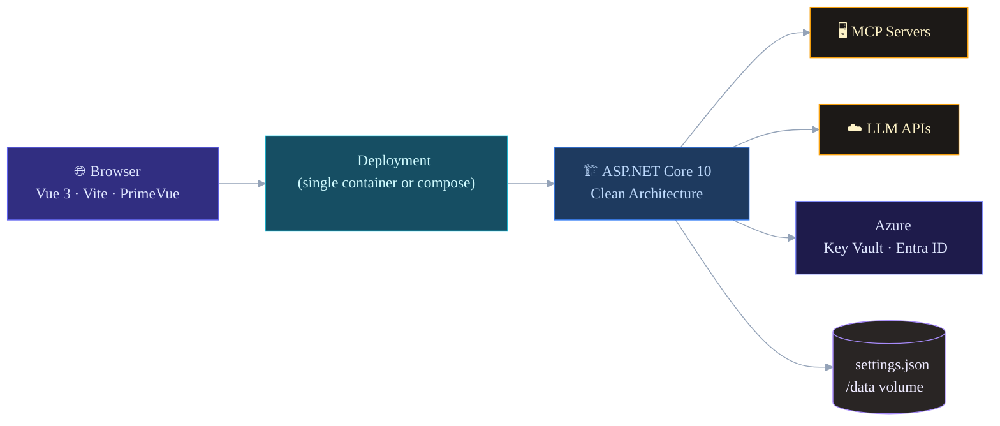
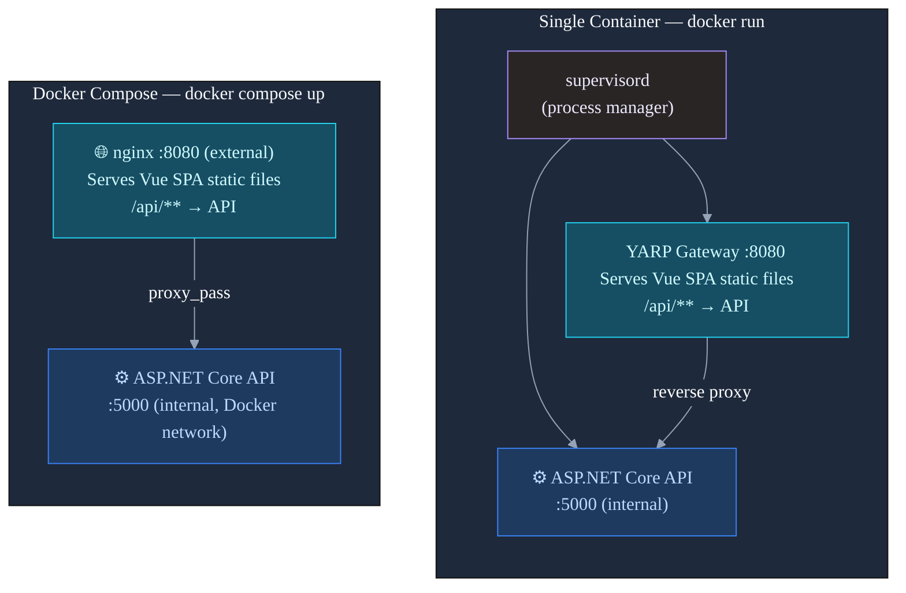
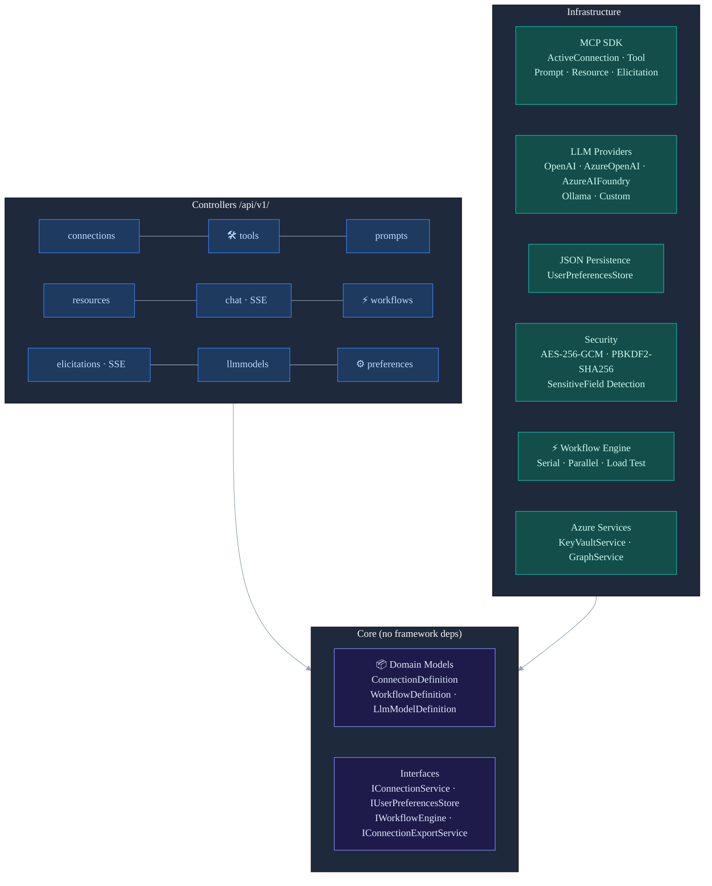
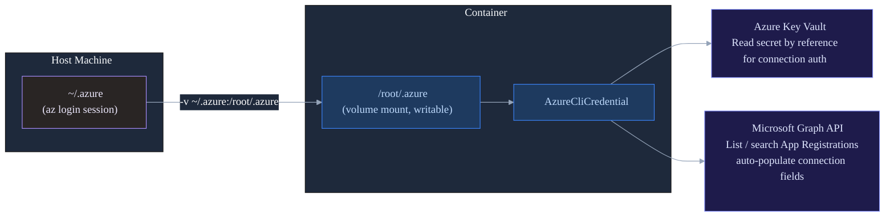
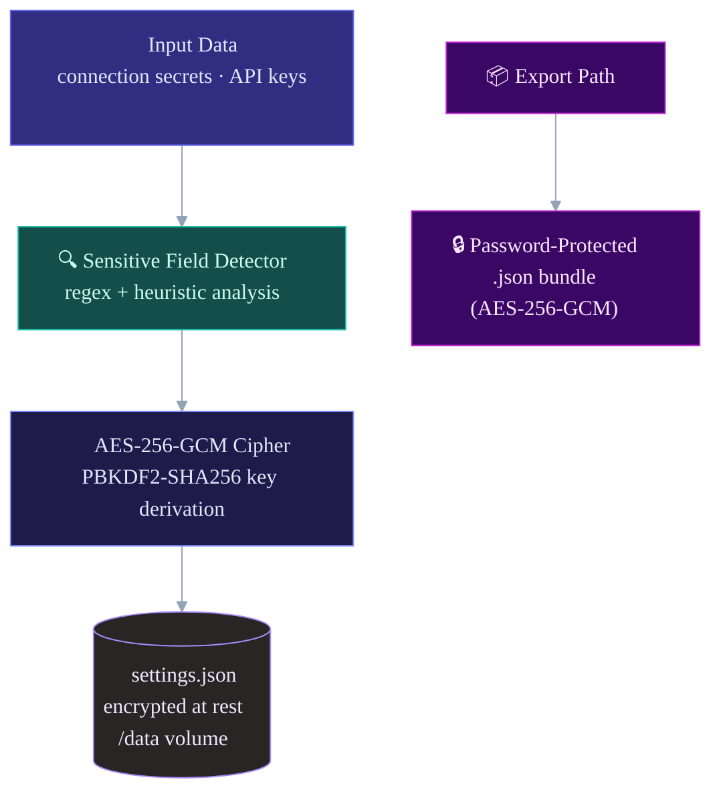

# MCP Explorer

[](https://github.com/garrardkitchen/mcp-explorer-vue/actions/workflows/ci-cd.yml)
[](LICENSE.md)
[](https://hub.docker.com/r/garrardkitchen/mcp-explorer-x)

A modern MCP (Model Context Protocol) server explorer — browse tools, prompts, resources, and chat with LLMs over live MCP connections. Built with a **Vue 3 / Vite / PrimeVue** frontend + **ASP.NET Core 10** backend using clean architecture.

> [!NOTE]
> 🔄 **This is a ground-up rewrite** of the original [MCP Explorer](https://mcp-explorer-docs.garrardkitchen.com/) (Blazor Server UI), migrated to Vue 3 + Vite + PrimeVue with a clean-architecture ASP.NET Core 10 backend, Docker-first deployment, and Azure Key Vault / Entra ID integration.

📚 **[Documentation →](https://mcp-explorer-x-docs.garrardkitchen.com/)** — full user guide and feature reference built with Hugo

## Features

- 🔌 **MCP Connections** — Streamable HTTP transport; custom headers; per-connection auth modes (Custom Headers, Azure Client Credentials, OAuth)
- 🔐 **Azure Key Vault Integration** — resolve connection secrets (client secrets, API keys) directly from Key Vault references; no plaintext secrets stored on disk
- 🏢 **Azure Entra App Registrations** — browse and select app registrations from your tenant via Microsoft Graph; auto-populates client ID and tenant fields
- 🛠️ **Tools** — browse and invoke tools with dynamic parameter forms; inspect JSON responses inline
- 💬 **Prompts** — list, execute, and evaluate prompts; pipe results directly to an LLM
- 📄 **Resources & Templates** — browse MCP resources; expand templates with runtime parameters
- 🤖 **Chat** — SSE-streamed AI chat with automatic MCP tool calling; shows token usage and active tool badges
- ⚡ **Workflows** — multi-step tool chain builder with execution history and built-in load testing
- 🙋 **Elicitations** — server-initiated input requests rendered as dynamic forms (text, bool, number, radio, checkbox, dropdown); real-time SSE delivery
- 🛡️ **Sensitive Data Protection** — regex + heuristic detection of secrets in tool parameters and chat messages; AES-256-GCM encryption at rest
- 🎨 **10 Themes** — Command Dark/Light, Nord, Dracula, Catppuccin Mocha, Solarized Light, GitHub Dark/Light, Material Dark/Light — persisted per user
- ⌨️ **Command Palette** — Ctrl+K / ⌘+K for keyboard-first navigation
- 📦 **Import / Export** — password-protected AES-256-GCM connection export; plain JSON workflow export

## Architecture

### System Overview



### Deployment Modes



### Backend Clean Architecture



### Azure Integration



### Elicitation Flow

```mermaid
%%{ init: { "theme": "base", "themeVariables": {
  "primaryColor":        "#6366f1",
  "primaryTextColor":    "#ffffff",
  "primaryBorderColor":  "#4f46e5",
  "lineColor":           "#94a3b8",
  "secondaryColor":      "#0f172a",
  "tertiaryColor":       "#1e293b",
  "background":          "#0f172a",
  "mainBkg":             "#1e293b",
  "nodeBorder":          "#334155",
  "clusterBkg":          "#1e293b",
  "titleColor":          "#f8fafc",
  "edgeLabelBackground": "#1e293b",
  "fontFamily":          "ui-monospace, monospace"
} } }%%

flowchart LR
  EL_SERVER["🖥️ MCP Server\nsends elicitation request"]
  EL_BUFFER["🏗️ API\nbuffers request"]
  EL_SSE["📡 SSE Stream\npushes to browser"]
  EL_FORM["🙋 Dynamic Form\n(text · bool · number\nradio · checkbox · dropdown)"]
  EL_POST["📨 POST\n/api/v1/elicitations/{id}/respond"]
  EL_FWD["🖥️ MCP Server\nreceives answer"]

  EL_SERVER --> EL_BUFFER --> EL_SSE --> EL_FORM --> EL_POST --> EL_FWD

  classDef server fill:#1c1917,stroke:#f59e0b,color:#fef3c7
  classDef api    fill:#1e3a5f,stroke:#3b82f6,color:#bfdbfe
  classDef sse    fill:#0c4a6e,stroke:#38bdf8,color:#e0f2fe
  classDef form   fill:#312e81,stroke:#6366f1,color:#e0e7ff

  class EL_SERVER,EL_FWD server
  class EL_BUFFER,EL_POST api
  class EL_SSE sse
  class EL_FORM form
```



### Security & Data Protection



### Project Layout

```
src/
├── Garrard.Mcp.Explorer.Core/           # Domain models + interfaces (no framework deps)
├── Garrard.Mcp.Explorer.Infrastructure/ # MCP SDK, LLM providers, persistence, security
│   ├── Azure/KeyVaultService.cs         #   Key Vault secret resolution
│   └── Azure/GraphService.cs            #   Microsoft Graph App Registration browser
├── Garrard.Mcp.Explorer.Api/            # ASP.NET Core Web API (9 controllers, versioned)
├── Garrard.Mcp.Explorer.Gateway/        # YARP reverse proxy + Vue SPA host
├── Garrard.Mcp.MessageContentProtection/# Sensitive data detection library
└── frontend/                            # Vue 3 + Vite + PrimeVue 4 SPA
    ├── src/api/          # Typed API client layer
    ├── src/stores/       # Pinia stores (chat, connections, preferences, themes, workflows)
    ├── src/views/        # 10 feature views
    ├── src/components/   # Shared components (CommandPalette, ThemeSwitcher, JsonViewer)
    └── src/themes/       # CSS custom property themes

tests/
├── Garrard.Tests.Mcp.Explorer.Core/           # 66 unit tests
├── Garrard.Tests.Mcp.Explorer.Infrastructure/ # 47 unit tests
└── Garrard.Tests.Mcp.Explorer.Api/            # 34 unit tests

docs/
└── learn/                                     # Hugo documentation site (serve with: hugo server -s docs/learn)
```

## Getting Started

### Prerequisites

- [.NET 10 SDK](https://dotnet.microsoft.com/download)
- [Node.js 22+](https://nodejs.org/) and npm
- Docker (optional, for containerised deployment)

### Development

```bash
# 1. Clone and restore
git clone <repo-url>
cd mcp-explorer-v2
dotnet restore

# 2. Copy env config
cp .env.example .env
# Edit .env with your LLM API keys

# 3. Start the API (terminal 1)
dotnet run --project src/Garrard.Mcp.Explorer.Api

# 4. Start the frontend dev server (terminal 2)
cd src/frontend
npm install
npm run dev
# Opens http://localhost:5173 (proxied to API on :5000)

# 5. Run tests
dotnet test
```

### Production Build

```bash
# Build frontend
cd src/frontend && npm run build && cd ../..

# Build and run the gateway (hosts built Vue SPA + proxies API)
dotnet publish src/Garrard.Mcp.Explorer.Gateway -c Release -o out/gateway
dotnet run --project src/Garrard.Mcp.Explorer.Api &
dotnet out/gateway/Garrard.Mcp.Explorer.Gateway.dll
```

## Docker

### Single Container (recommended for simple deployments)

```bash
# Build
docker build --build-arg APP_VERSION=2.0.0 -t mcp-explorer:2.0.0 .

# Run
dataRoot="$HOME/Library/Application Support/McpExplorerv2"
mkdir -p "${dataRoot}"

docker run --rm -it \
  -p 8091:8080 \
  -v "${dataRoot}:/data" \
  -v ~/.azure:/root/.azure \
  -e AZURE_CONFIG_DIR=/root/.azure \
  -e HOST_AZURE_CONFIG_DIR=${HOME}/.azure \
  -e PREFERENCES__StoragePath=/data/settings.json \
  -e ASPNETCORE_ENVIRONMENT=Production \
  garrardkitchen/mcp-explorer-x:latest
```

Open [http://localhost:8091](http://localhost:8091)

### Multi-Container (docker-compose)

```bash
cp .env.example .env
# Edit .env

docker compose up --build
```

Services: `api` on `:5000` (internal), `gateway` on `:8080` (external).

## Azure Setup

MCP Explorer can resolve connection secrets from Azure Key Vault and browse App Registrations via Microsoft Graph. This requires an `az login` session on the host machine and the `~/.azure` directory mounted into the container.

### Prerequisites

```bash
az login
az account set --subscription "<your-subscription-id>"
```

### Required Azure RBAC Roles

| Resource | Role | Purpose |
|---|---|---|
| Azure Key Vault | **Key Vault Secrets User** | Read secret values by name or reference |
| Azure Key Vault | **Key Vault Reader** *(optional)* | List available secrets in the picker UI |

Assign with:

```bash
az role assignment create \
  --assignee $(az ad signed-in-user show --query id -o tsv) \
  --role "Key Vault Secrets User" \
  --scope /subscriptions/<sub-id>/resourceGroups/<rg>/providers/Microsoft.KeyVault/vaults/<vault-name>
```

### Microsoft Graph API Permissions

The signed-in user needs one of:

| Permission | Type | Purpose |
|---|---|---|
| `Application.Read.All` | Delegated | Browse and search App Registrations |

This is a delegated permission using your `az login` session — no app registration or client secret is required for the explorer itself.

If `Application.Read.All` is not pre-consented in your tenant, a Global Administrator must grant admin consent or the user must have the **Application Administrator** or **Cloud Application Administrator** Entra role.

### Key Vault Network Rules

If your Key Vault has a firewall enabled, you must allow access from the machine running the container:

1. **Trusted Microsoft services** — not applicable (this is not an Azure service)
2. **IP allowlist** — add your machine's public IP:
   ```bash
   az keyvault network-rule add \
     --name <vault-name> \
     --ip-address <your-public-ip>
   ```
3. **Private endpoint** — if using a private endpoint, the container must be on the same VNet or use a VPN/tunnel.

> **Tip:** For local development, temporarily set the Key Vault access to "Allow all networks" or add your IP. Re-enable the firewall for production.

### Volume Mount

Mount your host `~/.azure` directory **without** `:ro` — Azure CLI must be able to write session files:

```bash
-v ~/.azure:/root/.azure   # writable — required for token refresh
-e AZURE_CONFIG_DIR=/root/.azure
```

## Environment Variables

Copy `.env.example` to `.env` and fill in your values. Key variables:

| Variable | Description | Default |
|---|---|---|
| `ASPNETCORE_ENVIRONMENT` | Runtime env — controls logging/error detail | `Production` |
| `AppMetadata__Version` | Version string shown in UI footer | `0.5.0` |
| `MCP_CLIENT_NAME` | Client name sent to MCP servers in handshake and User-Agent | `mcp-explorer` |
| `MCP_DATA_PATH` | **Host** directory mounted as `/data` — persists connections, workflows, models | _(anonymous volume)_ |
| `PREFERENCES__StoragePath` | Absolute path to `settings.json` inside the container | `/data/settings.json` |
| `HOST_AZURE_CONFIG_DIR` | Absolute path to host `~/.azure` — mounted into container for `AzureCliCredential` | _(empty)_ |
| `AZURE_CONFIG_DIR` | Path to `.azure` directory inside the container | `/root/.azure` |
| `LlmService__OpenAiBaseUrl` | Base URL for OpenAI-compatible APIs | `https://api.openai.com/v1` |
| `LlmService__AzureApiVersion` | Azure OpenAI API version query param | `2024-02-15-preview` |
| `LlmService__MaxRetryAttempts` | Max LLM request retries | `3` |
| `LlmService__TimeoutSeconds` | LLM response timeout | `30` |
| `ToolInvoke__TimeoutSeconds` | MCP tool call timeout (0 = no limit) | `300` |
| `ToolInvoke__MaxRetryAttempts` | Tool call retry attempts | `2` |
| `Elicitation__TimeoutSeconds` | Elicitation dialog timeout (0 = wait forever) | `0` |
| `GATEWAY_PORT` | Host port the app is exposed on | `8090` |
| `ReverseProxy__Clusters__api-cluster__Destinations__api__Address` | API address for YARP (docker-compose only) | `http://api:5000/` |
| `VITE_API_BASE_URL` | Browser API base URL (empty = same origin via gateway) | _(empty)_ |
| `VITE_APP_VERSION` | App version baked into the frontend bundle | `0.5.0` |

> **Note:** `VITE_*` variables are baked into the static JS bundle at build time and cannot be changed at runtime.

See `.env.example` for the full annotated list.

## API

All endpoints are versioned at `/api/v1/`. Swagger UI available at `/swagger` in development.

| Prefix | Description |
|---|---|
| `/api/v1/connections` | CRUD + connect/disconnect MCP servers |
| `/api/v1/tools` | List and invoke tools per connection |
| `/api/v1/prompts` | List and execute prompts |
| `/api/v1/resources` | List and read resources + templates |
| `/api/v1/chat` | SSE streaming chat with tool calling |
| `/api/v1/workflows` | Workflow CRUD, execution, load test |
| `/api/v1/elicitations` | SSE stream + respond to server-initiated requests |
| `/api/v1/llmmodels` | LLM model definitions CRUD |
| `/api/v1/preferences` | User preferences + theme |
| `/api/v1/azure` | Azure subscription list, Key Vault secret resolution, App Registration search |

## Themes

Ten built-in themes, selectable via the top-bar theme switcher or Command Palette:

| ID | Name | Mode |
|---|---|---|
| `command-dark` | Command Dark | Dark |
| `command-light` | Command Light | Light |
| `nord` | Nord | Dark |
| `dracula` | Dracula | Dark |
| `catppuccin` | Catppuccin Mocha | Dark |
| `solarized` | Solarized Light | Light |
| `material` | Material Dark | Dark |
| `material-light` | Material Light | Light |
| `github` | GitHub Dark | Dark |
| `github-light` | GitHub Light | Light |

Theme is persisted to `POST /api/v1/preferences/theme` and cached in `localStorage`.

## Community

| | |
|---|---|
| 📖 **Documentation** | [mcp-explorer-x-docs.garrardkitchen.com](https://mcp-explorer-x-docs.garrardkitchen.com/) |
| 🐛 **Report a bug** | [Open an issue](https://github.com/garrardkitchen/mcp-explorer-vue/issues/new/choose) |
| 💡 **Request a feature** | [Open an issue](https://github.com/garrardkitchen/mcp-explorer-vue/issues/new/choose) |
| 🔒 **Report a vulnerability** | [Security policy](.github/SECURITY.md) |
| 🤝 **Contributing guide** | [CONTRIBUTING.md](.github/CONTRIBUTING.md) |
| 📋 **Pull request template** | [PR template](.github/PULL_REQUEST_TEMPLATE.md) |
| 📜 **Code of conduct** | [CODE_OF_CONDUCT.md](.github/CODE_OF_CONDUCT.md) |
| 📚 **Cite this project** | [CITATION.cff](CITATION.cff) |

## Contributing

1. Read [CONTRIBUTING.md](.github/CONTRIBUTING.md) for the full guide.
2. Fork and create a feature branch using [Conventional Commits](https://www.conventionalcommits.org/).
3. Run `dotnet test` — all tests must pass.
4. Run `npm run build` in `src/frontend` — zero errors.
5. Open a PR using the [PR template](.github/PULL_REQUEST_TEMPLATE.md).

## License

MIT — see [LICENSE.md](LICENSE.md)
