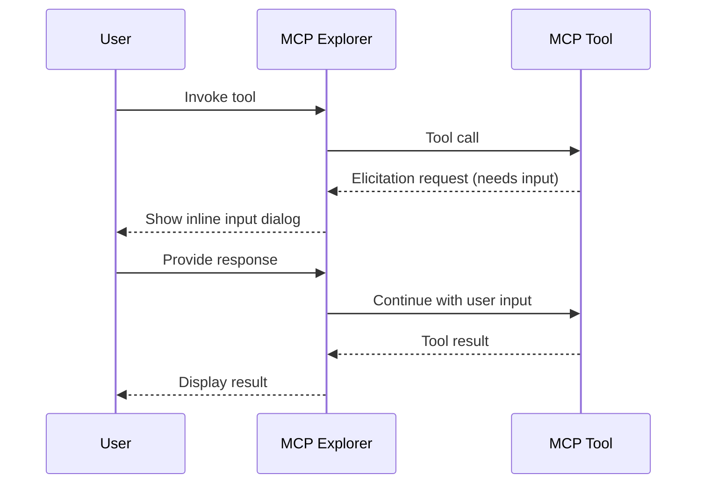

## What are Elicitations?

Some MCP tools need additional user input mid-execution — for example, asking which of several options to proceed with, or requesting a confirmation before a destructive operation. This is the MCP *elicitation* feature.

MCP Explorer surfaces these requests as **inline dialogs** that pause the tool execution and wait for your response.

---

## How Elicitations Work

---

## Responding to an Elicitation

When a tool makes an elicitation request, an inline prompt appears within the tool card:

1. **Read the prompt** — the tool explains what input it needs

*The `guess_the_number` tool asks for a range, a title, a date, and multi-select options — all in one elicitation form.*

2. **Fill in the form** — the form type depends on what the tool requests:

| Input Type | UI Control | When Used |
|------------|-----------|-----------|
| Short text | Text input | Single-line string |
| Long text | Textarea | Multi-line content |
| Yes/No | Toggle / radio | Boolean confirmation |
| One of few options (≤3) | Radio buttons | Small enum choice |
| One of many options (>3) | Dropdown | Large enum list |
| Multiple selections | Multi-select | Array of choices |

*Fill in all the form fields — radio buttons, text inputs, date pickers, and multi-select checkboxes are all supported.*

3. **Click Accept** to continue the tool — or **Decline** to cancel the elicitation

*After the first response, the tool may make a second elicitation request — here asking for the actual numeric guess.*

*Enter the value and click Accept to submit.*

4. The tool receives your input and continues execution

*The final tool result appears after all elicitation steps are complete.*

---

## Declining an Elicitation

Click **Decline** to reject the elicitation. The tool will receive a declined response and may abort or continue with a default value, depending on how it's implemented.

---

## Elicitation History

The Elicitations page shows all past elicitation requests across sessions:
- The tool that requested it
- The prompt text
- Your response (or "Declined")
- Timestamp

This is useful for auditing what data you've provided to tools.

---

## Tips

- Elicitations are tool-server-defined — the prompt text and available options come from the MCP server
- If a tool frequently elicits the same input, consider whether it supports default parameter values that could skip the elicitation
