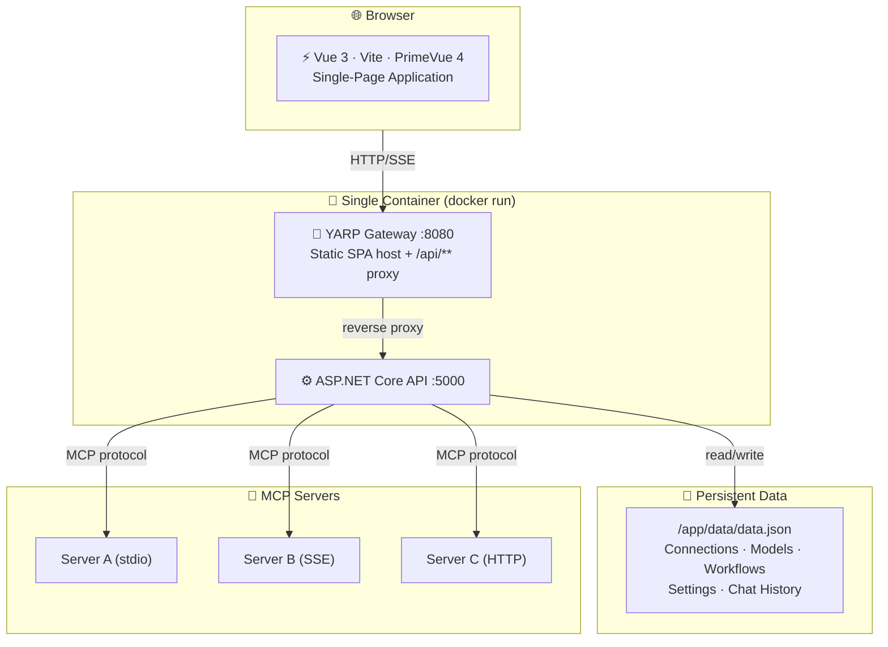
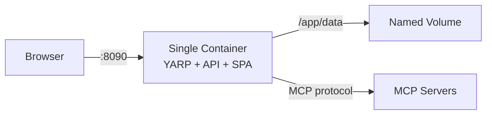
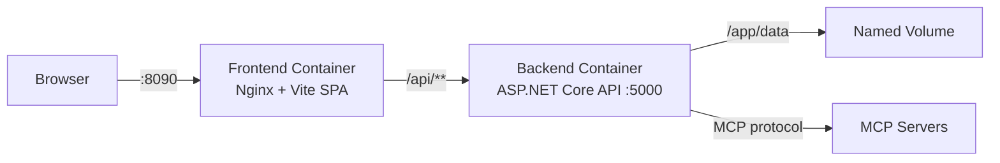
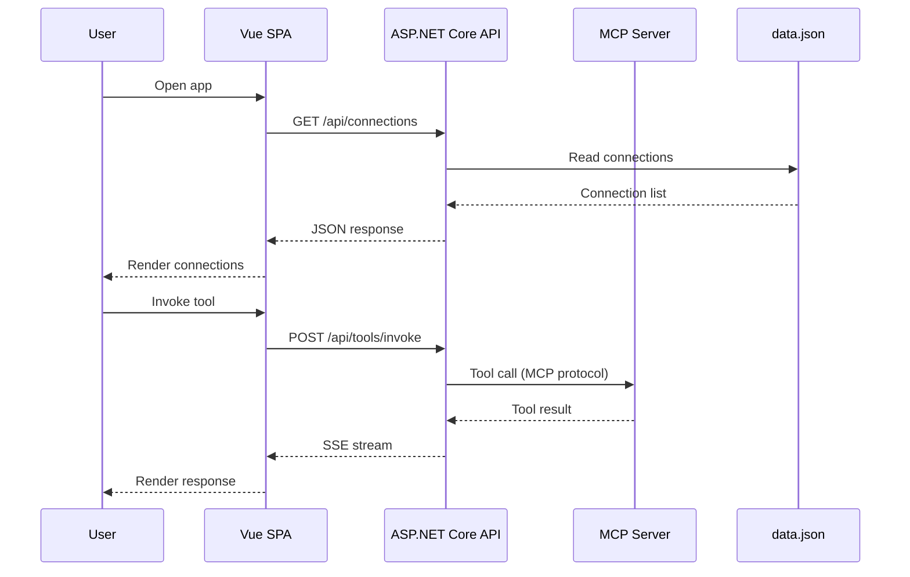

## Architecture Overview

MCP Explorer X follows a clean architecture pattern with a Vue 3 SPA frontend and an ASP.NET Core backend.



---

## Deployment Modes

### Single Container

The default deployment — everything in one image.

```bash
docker run -d \
  -p 8090:8080 \
  -v mcp-explorer-data:/app/data \
  ghcr.io/your-username/mcp-explorer-x:latest
```



---

### Docker Compose (Separate Services)

For teams or when you want independent scaling of frontend and backend.

```bash
docker compose up -d
```



---

## Data Flow



---

## Technology Stack

| Layer | Technology |
|-------|-----------|
| Frontend | Vue 3, Vite, PrimeVue 4, TypeScript |
| Backend | ASP.NET Core 9, C# |
| MCP SDK | ModelContextProtocol 1.2.0 |
| Gateway | YARP reverse proxy |
| Persistence | JSON file (single file, no database) |
| Container | Docker, multi-stage build |
